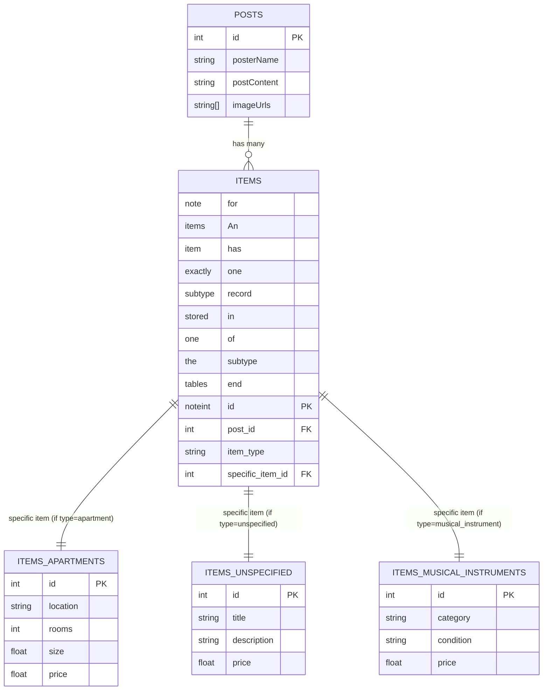

Hi!
This is my apartment scraper

Prerequisites:

- A docker container created from the ollama image, named 'ollama' with your heart's desire model installed, which you may specify in the server's `model.const.ts`
  NOTE: it must map its 11434 port to your own.
  NOTE: it is recommended to expose your GPU to your container! :)

## OLTP DB

> [!NOTE]
> In the items table, an item has exactly one subtype record stored in one of the subtype tables (e.g. A `Post` about an `Item` which is an `Apartment`)
> So, while this is the diagram, it may not accurately represent the actual state of the DB.
