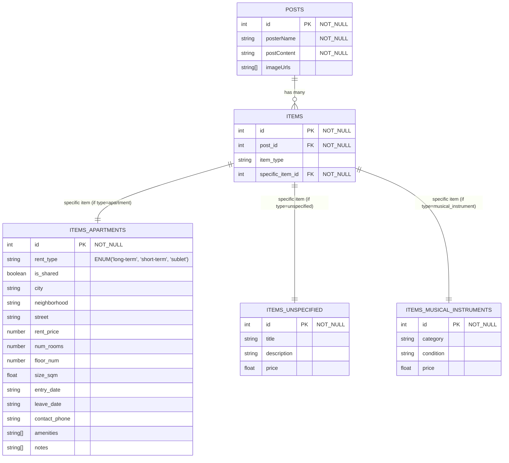

## OLTP DB

> [!NOTE]
> In the items table, an item has exactly one subtype record stored in one of the subtype tables (e.g. A `Post` about an `Item` which is an `Apartment`)
> So, while this is the diagram, it may not accurately represent the actual state of the DB.
